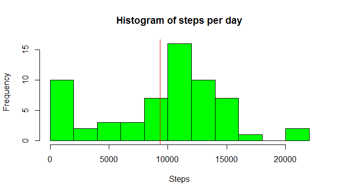
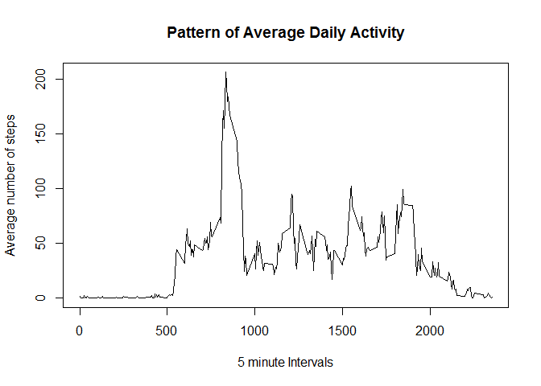
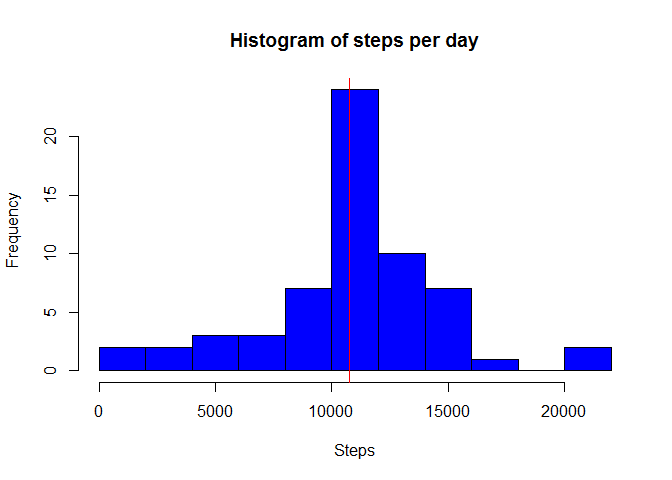

# Reproducible Research: Peer Assessment 1
This is the exercise of Week 2 for the class Reproducible Research.

We are considering 4 sections and/or questions:


## Loading and preprocessing the data

Here is where I load the activity data into a format suitable for analysis and i look at the first few rows


```r
df <- read.csv("activity.csv", header = TRUE, sep =",")
head(df)
```

```
##   steps       date interval
## 1    NA 2012-10-01        0
## 2    NA 2012-10-01        5
## 3    NA 2012-10-01       10
## 4    NA 2012-10-01       15
## 5    NA 2012-10-01       20
## 6    NA 2012-10-01       25
```

## What is the mean total number of steps taken per day?

We are going to ignore the missing values in the dataset and calculate the total number of steps taken per day


```r
tdf <- group_by(df,date)
tsdf <- summarise(tdf, sumstep = sum(steps, na.rm = TRUE))
```

Best way to see the total number of steps taken each day is in the following histogram:

```r
hist(tsdf$sumstep, 
     main = "Histogram of steps per day", 
     breaks = 15, 
     col = "green", 
     xlab = "Steps")

abline(v=mean(tsdf$sumstep), col = "red", ylab = "mean")
```

<!-- -->

We are also going to calculate the mean and median of the total number of steps taken daily
The table below show the media and mean of the total number of steps taken daily


```r
mm<-median(tsdf$sumstep)
ma <- mean(tsdf$sumstep)
ms <- sum(tsdf$sumstep)
summary(tsdf$sumstep)
```

```
##    Min. 1st Qu.  Median    Mean 3rd Qu.    Max. 
##       0    6780   10400    9350   12800   21200
```

**In summary, the total mean is 9354.23 and the total median is 10395 **


## What is the average daily activity pattern?

We are going to visualize the average daily activity in the time series plot below. It shows the 5-minute interval (x-axis) and the average number of steps taken, averaged across all days (y-axis)


```r
idf <- group_by(df, interval)
isdf <- summarise(idf, meanstep = mean(steps, na.rm = TRUE))
plot(isdf$interval, 
     isdf$meanstep, 
     type = "l", 
     xlab ="5 minute Intervals" , 
     ylab = "Average number of steps", 
     main = "Pattern of Average Daily Activity")
```

<!-- -->


```r
maxsteps <- filter(isdf, meanstep == max(isdf$meanstep))
maxint <- maxsteps$meanstep
int <- maxsteps$interval
```

**The maximum number of steps per 5-minute interval on average is : 206.17 recorded at interval 835 **


## Inputing missing values
In this section we are going to complete wth missing (coded as NA) with the average daily number of steps.

The total number of missing values in the dataset (i.e. the total number of rows with NAs) is:


```r
sum(is.na(df$steps))
```

```
## [1] 2304
```

We are now filling in all of the missing values in the dataset with the mean for that 5-minute interval


```r
tdf <- group_by(df,interval)
mddf <- summarise(tdf, mstep = mean(steps, na.rm = TRUE))
ff <- left_join(tdf, mddf)
```

```
## Joining by: "interval"
```

```r
ff <- mutate(ff, steps = ifelse (is.na(steps), mstep, steps))
```

Here is how the new data set looks like:

```r
head(ff)
```

```
## Source: local data frame [6 x 4]
## Groups: interval [6]
## 
##   steps       date interval mstep
##   (dbl)     (fctr)    (int) (dbl)
## 1 1.717 2012-10-01        0 1.717
## 2 0.340 2012-10-01        5 0.340
## 3 0.132 2012-10-01       10 0.132
## 4 0.151 2012-10-01       15 0.151
## 5 0.075 2012-10-01       20 0.075
## 6 2.094 2012-10-01       25 2.094
```

Best way to see the total number of steps taken each day is in the following histogram:


```r
tff <- group_by(ff,date)
tffdf <- summarise(tff, sumstep = sum(steps, na.rm = TRUE))
hist(tffdf$sumstep, 
     main = "Histogram of steps per day", 
     breaks = 15, 
     col = "blue", 
     xlab = "Steps")
abline(v=mean(tffdf$sumstep), col = "red", ylab = "mean")
```

<!-- -->


We are also going to calculate the mean and median of the total number of steps taken daily
The table below show the media and mean of the total number of steps taken daily


```r
ta <- mean(tffdf$sumstep)
tta <- median(tffdf$sumstep)
nsum <- sum(tffdf$sumstep)
summary(tffdf$sumstep)
```

```
##    Min. 1st Qu.  Median    Mean 3rd Qu.    Max. 
##      41    9820   10800   10800   12800   21200
```

**In summary, the total mean is 10766.19 and the total median is 10766.19 **

Do these values differ from the estimates from the first part of the assignment?

**Yes: here are the differences Mean with NAs : 9354.23 and Mean without NAs : 10766.19 Median with NAs : 10395 Median without NAs : 10766.19 **

What is the impact of inputing missing data on the estimates of the total daily number of steps?


**The total daily steps with NA is 570608 versus 656737.51 after filling the NAs with the mean per interval. ** 


## Are there differences in activity patterns between weekdays and weekends?

Here we create a new variables in the dataset indicating whether a given date is a weekday or weekend day.


```r
ff <- mutate(ff, day = weekdays(as.Date(date)))
fff <- mutate(ff, woe = ifelse((day == "Sunday" | day == "Saturday"), "Weekend", "Weekday"))
head(fff)
```

```
## Source: local data frame [6 x 6]
## Groups: interval [6]
## 
##   steps       date interval mstep    day     woe
##   (dbl)     (fctr)    (int) (dbl)  (chr)   (chr)
## 1 1.717 2012-10-01        0 1.717 Monday Weekday
## 2 0.340 2012-10-01        5 0.340 Monday Weekday
## 3 0.132 2012-10-01       10 0.132 Monday Weekday
## 4 0.151 2012-10-01       15 0.151 Monday Weekday
## 5 0.075 2012-10-01       20 0.075 Monday Weekday
## 6 2.094 2012-10-01       25 2.094 Monday Weekday
```


We visualize in a time series plot the 5-minute interval (x-axis) and the average number of steps taken, averaged across all weekday days or weekend days (y-axis).


```r
library(lattice)
fffg<- group_by(fff, woe, interval)
fffgg <- summarise(fffg, avestep = mean(steps))
xyplot(avestep ~ interval | woe, data = fffgg, layout = c(1,2), type ="l", xlab = "Interval", ylab ="Number of steps")
```

<!-- -->

**There seems to be differences in the activity pattern; in the weekend where activity starts later and there is more constant high level activity during the whole day. On Week days there is a significant spike of activity around the 835 interval - maybe is zumba time. **  


